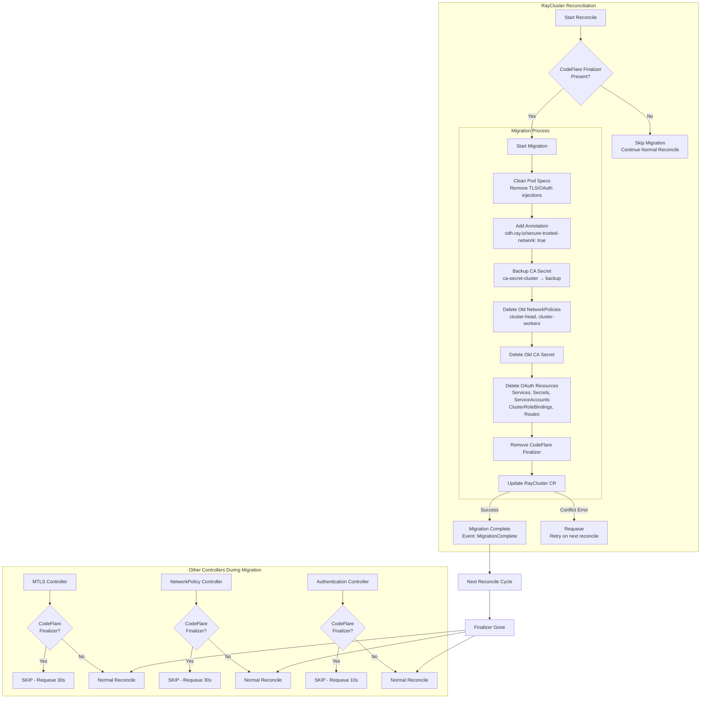

# CodeFlare to KubeRay Migration Plan

## Executive Summary

This document describes the automated migration path for RayClusters upgrading from ODH/RHOAI versions that used `codeflare-operator` (RHOAI 2.x) to newer versions where KubeRay directly manages MTLS, NetworkPolicy, and Authentication (RHOAI 3.x+).

The migration is **fully automated** and requires no manual intervention from users.

## Migration Trigger

The migration is triggered by the presence of the **CodeFlare operator finalizer**:

```
ray.openshift.ai/oauth-finalizer
```

This finalizer was added by `codeflare-operator` to all RayClusters it managed. Its presence indicates the cluster needs migration.

## Migration Flow Diagram



## Conflict Prevention Strategy

### Problem: Optimistic Concurrency Conflicts

Multiple controllers watch RayClusters and may attempt to update them simultaneously:

| Controller | Updates CR? | Potential Conflict |
|------------|-------------|-------------------|
| **RayClusterReconciler** (migration) | Yes - removes finalizer, adds annotation | Primary |
| **AuthenticationController** | Yes - adds finalizer, sets enableIngress | High |
| **MTLSController** | No - only creates cert-manager resources | None |
| **NetworkPolicyController** | No - only creates NetworkPolicies | None |

### Solution: Finalizer-Based Coordination

All controllers check for the CodeFlare finalizer at the start of reconciliation:

```go
// Skip reconciliation if CodeFlare finalizer is present - migration must complete first
for _, finalizer := range instance.Finalizers {
    if finalizer == "ray.openshift.ai/oauth-finalizer" {
        logger.Info("CodeFlare finalizer present, skipping until migration completes")
        return ctrl.Result{RequeueAfter: 30 * time.Second}, nil
    }
}
```

### Why This Works

1. **Migration runs first** - The main RayCluster controller handles migration before other operations
2. **Other controllers skip** - They detect the finalizer and requeue instead of processing
3. **Single Update** - Migration makes all CR modifications in-memory, then persists with one `Update()` call
4. **Conflict recovery** - If `Update()` fails (conflict), the error causes a requeue; next reconcile retries
5. **Clean handoff** - After migration removes the finalizer, other controllers proceed normally

## What Gets Cleaned Up

### Pod Spec Modifications (from CodeFlare webhook)

| Component | CodeFlare Source | Removed |
|-----------|------------------|---------|
| `oauth-proxy` container | `raycluster_webhook.go:38` | ✅ |
| `proxy-tls-secret` volume | `raycluster_webhook.go:39` | ✅ |
| `ca-vol` volume | `raycluster_webhook.go:341` | ✅ |
| `server-cert` volume (EmptyDir) | `raycluster_webhook.go:348` | ✅ |
| `ca-vol` mount | `raycluster_webhook.go:297` | ✅ |
| `server-cert` mount | `raycluster_webhook.go:301` | ✅ |
| `MY_POD_IP` env var | `raycluster_webhook.go:311` | ✅ |
| `RAY_USE_TLS` env var | `raycluster_webhook.go:319` | ✅ |
| `RAY_TLS_SERVER_CERT` env var | `raycluster_webhook.go:323` | ✅ |
| `RAY_TLS_SERVER_KEY` env var | `raycluster_webhook.go:327` | ✅ |
| `RAY_TLS_CA_CERT` env var | `raycluster_webhook.go:331` | ✅ |
| `create-cert` initContainer | `raycluster_webhook.go:40` | ✅ |
| `serviceAccountName` | `raycluster_webhook.go:89` | ✅ (cleared) |
| `enableIngress: true` | `raycluster_webhook.go:220` | ✅ (set to false) |

### External Resources (from CodeFlare controller)

| Resource | Name Pattern | Action |
|----------|--------------|--------|
| Finalizer | `ray.openshift.ai/oauth-finalizer` | Removed |
| CA Secret | `ca-secret-{cluster}` | Backed up, then deleted |
| NetworkPolicy (head) | `{cluster}-head` | Deleted |
| NetworkPolicy (workers) | `{cluster}-workers` | Deleted |
| ClusterRoleBinding | By label `ray.openshift.ai/cluster-name` | Deleted |
| OAuth Service | By label `ray.openshift.ai/cluster-name` | Deleted |
| OAuth Secret | By label `ray.openshift.ai/cluster-name` | Deleted |
| OAuth ServiceAccount | By label `ray.openshift.ai/cluster-name` | Deleted |
| Routes (OpenShift) | By label `ray.openshift.ai/cluster-name` | Deleted |

## What Gets Added

After cleanup, the migration adds:

| Item | Value | Purpose |
|------|-------|---------|
| Annotation | `odh.ray.io/secure-trusted-network: "true"` | Triggers KubeRay's MTLS and NetworkPolicy controllers |

## Implementation Details

### Files Modified

1. **`raycluster_controller.go`**
   - Added `CodeFlareOperatorFinalizer` constant
   - Added `cleanCodeFlareInjections()` function
   - Added `migrateFromCodeFlare()` function
   - Integration point in `rayClusterReconcile()` (early in reconcile loop)

2. **`raycluster_mtls_controller.go`**
   - Added CodeFlare finalizer check at start of `Reconcile()`

3. **`networkpolicy_controller.go`**
   - Added CodeFlare finalizer check at start of `Reconcile()`

4. **`authentication_controller.go`**
   - Added CodeFlare finalizer check at start of `Reconcile()`

### Key Code Snippets

#### Migration Trigger Check

```go
// migrateFromCodeFlare performs a one-time migration from CodeFlare operator management
func (r *RayClusterReconciler) migrateFromCodeFlare(ctx context.Context, instance *rayv1.RayCluster) error {
    // Check if CodeFlare finalizer is present - this is the ONLY trigger
    hasCodeFlareFinalizer := false
    for _, finalizer := range instance.Finalizers {
        if finalizer == CodeFlareOperatorFinalizer {
            hasCodeFlareFinalizer = true
            break
        }
    }

    // If no finalizer, skip migration (already migrated or never managed by CodeFlare)
    if !hasCodeFlareFinalizer {
        return nil
    }
    
    // ... perform migration ...
}
```

#### Controller Skip Logic

```go
// Skip reconciliation if CodeFlare finalizer is present - migration must complete first
for _, finalizer := range instance.Finalizers {
    if finalizer == CodeFlareOperatorFinalizerMTLS {
        logger.Info("CodeFlare finalizer present, skipping MTLS reconciliation until migration completes")
        return ctrl.Result{RequeueAfter: RayClusterMTLSDefaultRequeueDuration}, nil
    }
}
```

## Testing Strategy

### Unit Tests

1. **Finalizer detection** - Verify migration only runs when finalizer is present
2. **Pod spec cleanup** - Verify all CodeFlare injections are removed
3. **Resource cleanup** - Verify old resources are deleted
4. **Annotation addition** - Verify secure-trusted-network annotation is added
5. **Conflict handling** - Verify proper requeue on Update() conflicts

### Integration Tests

1. **End-to-end migration** - Deploy RayCluster with CodeFlare finalizer, verify migration completes
2. **Controller coordination** - Verify other controllers skip during migration
3. **Idempotency** - Run migration multiple times, verify no errors
4. **Rollout** - Verify pods are recreated with new configuration after migration

## Risks and Mitigations

| Risk | Mitigation |
|------|------------|
| Update conflicts during migration | Controllers skip when finalizer present; conflicts cause requeue |
| Pod disruption during migration | Migration only modifies CR; pod recreation is managed by KubeRay |
| Lost CA certificates | CA secret is backed up before deletion |
| Orphaned cluster-scoped resources | ClusterRoleBindings are explicitly deleted by label |
| Partial migration failure | Finalizer remains until migration succeeds; retries on error |

## Backward Compatibility

- RayClusters **without** the CodeFlare finalizer are unaffected
- RayClusters **with** the finalizer are automatically migrated on first reconcile
- Migration is **idempotent** - running multiple times has no adverse effects
- No manual intervention required from users

## Rollback

If issues are discovered post-migration:

1. The backed-up CA secret (`ca-secret-{cluster}-backup-{timestamp}`) can be restored
2. Users can manually recreate the RayCluster with CodeFlare-compatible configuration
3. The migration does not modify the RayCluster spec in ways that prevent rollback

## Timeline

Migration happens automatically during the **first reconciliation** after upgrade:

1. User upgrades ODH/RHOAI (removes codeflare-operator, updates kuberay)
2. KubeRay controller starts
3. RayCluster reconciliation triggered
4. Migration detects finalizer → executes one-time migration
5. Finalizer removed → migration complete
6. Subsequent reconciliations skip migration (no finalizer)
